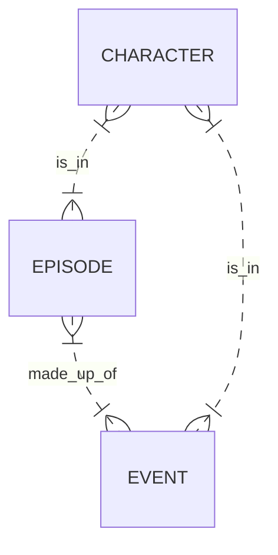

# Into the Buffyverse - a Project by Team Kitten-Poker

This is a Node.js template for the Makers final engineering project.

It uses:

- [Express](https://expressjs.com/) web framework for Node.js.
- [Nodemon](https://nodemon.io/) to reload the server automatically.
- [Handlebars](https://handlebarsjs.com/) to render view templates.
- [Mongoose](https://mongoosejs.com) to model objects in MongoDB.
- [ESLint](https://eslint.org) for linting.
- [Jest](https://jestjs.io/) for testing.
- [Cypress](https://www.cypress.io/) for end-to-end testing.

## Card wall

https://trello.com/b/i8kn5ccu/to-do

## Entities



## Quickstart

### Install Node.js

1. Install Node Version Manager (NVM)
   Check if you have it first with `nvm --version`. If not, use:

   ```
   brew install nvm
   ```

   Then update your `~/.bash_profile`, with the `source ~/.zshrc_file` command if you have OhMyZSH installed.

   If you already have nvm, you can update with the following cURL command:
   `curl -o- https://raw.githubusercontent.com/nvm-sh/nvm/v0.39.1/install.sh | bash` (see https://github.com/nvm-sh/nvm) - you may need to restart your terminal.

2. Open a new terminal
3. Install the latest version of [Node.js](https://nodejs.org/en/), currently `18.10.0` (check if you have it first with `node --version`).
   ```
   nvm install node
   ```
4. Update npm with `npm install -g npm@latest` (You may need to prefix these commands with sudo, especially on Linux, or OS X if you installed Node using its default installer - see https://docs.npmjs.com/try-the-latest-stable-version-of-npm.)

### Set up your project

1. Fork this repository
2. Rename your fork to `BuffyverseClone-<selected_name>`
3. Clone your fork to your local machine
4. Install Node.js dependencies
   ```
   npm install
   ```
5. Install an ESLint plugin for your editor. For example: [linter-eslint](https://github.com/AtomLinter/linter-eslint) for Atom. You can use `npm i -g eslint` to install globally.
6. Install or update MongoDB (see https://github.com/mongodb/homebrew-brew)
   (You can check your version with the `mongod --version` command.)
   ```
   brew tap mongodb/brew
   brew install mongodb-community
   ```
   _Note:_ If you see a message that says `If you need to have mongodb-community@5.0 first in your PATH, run:`, follow the instruction. Restart your terminal after this.
7. Start MongoDB
   ```
   brew services start mongodb-community@5.0
   ```

### Start

1. Start the server
   ```
   npm start
   ```
2. Browse to [http://localhost:3000](http://localhost:3000)

#### Start test server

The server must be running locally with test configuration for the
integration tests to pass.

```
npm run start:test
```

This starts the server on port `3030` and uses the `acebook_test` MongoDB database,
so that integration tests do not interact with the development server.

### Test

- Run all tests
  ```
  npm test
  ```
- Run a check
  ```bash
  npm run lint              # linter only
  npm run test:unit         # unit tests only
  npm run test:integration  # integration tests only (or `npx cypress run`)
  ```

## Setting Up the Database

1) Create a cluster - https://www.mongodb.com/cloud/atlas/lp/general/try.
2) Sign Up and verify email address.
3) Setup credentials (username and password).
4) Select Cloud Environment option and input IP address (click button).
5) Click "Connect" on page and choose your mongoDB interface of choice.
6) Copy Connection String to use to connect!
7) (For MongoDB Compass users) If you get "bad auth" error, manually enter your password in the Advanced Connections Option under the Authentication tab and it should connect.
8) Create "into_the_buffyverse" and "into_the_buffyverse_test" databases, containing collections "characters", "episodes" and "events".
9) You may now run and test (see above for npm terminal commands)!

## MongoDB Connection Errors?

You may experience MongoDB connection errors when running the tests or trying to use the application. Here are some tips that might help resolve such issues.

- Check that MongoDB is installed using `mongo --version`
- Check that it's running using `brew services list`
